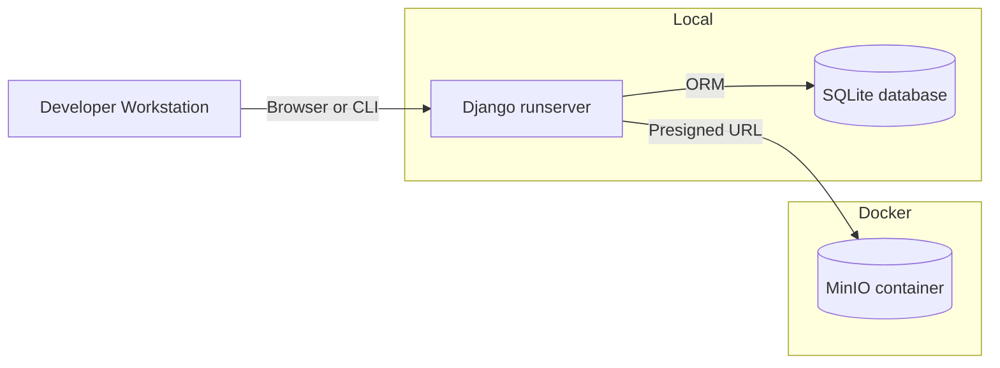

# Deployment / topology (local dev)

Environments
- Local dev: Dockerized MinIO, Django runserver, SQLite DB.
- Later: Docker Compose for MinIO + Postgres; Django served via ASGI (uvicorn/gunicorn).
- Cloud: Replace MinIO with S3 or managed object store, Postgres as managed DB.
