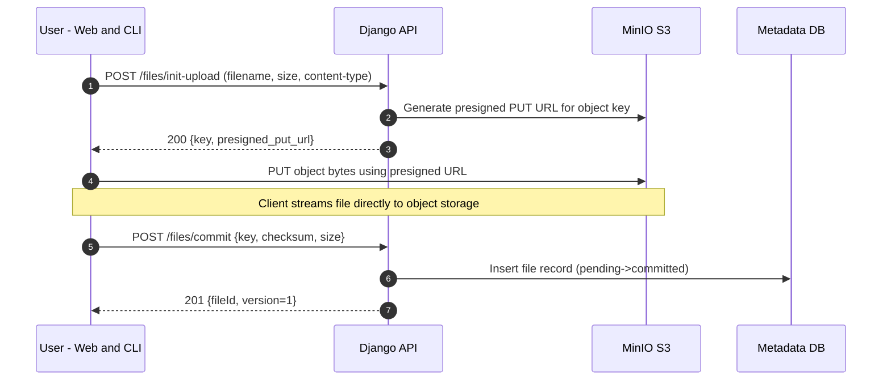

# Upload flow (sequence)

Edge cases
- If upload fails before commit, the object is orphaned; later GC/lifecycle can clean up.
- Server verifies checksum/size on commit when possible and rejects mismatches.
